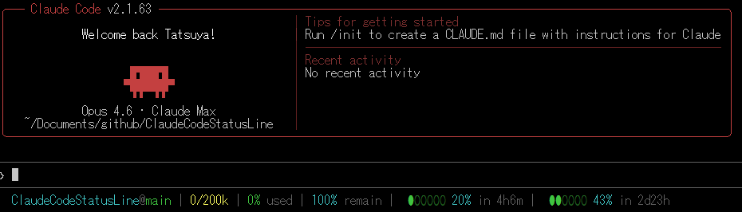

# Claude Code Status Line

A custom status line for [Claude Code](https://claude.com/claude-code) that displays token usage, rate limits, and remaining time in a single compact line.

## Screenshot



## What it shows

| Segment | Description |
|---------|-------------|
| **CWD@Branch** | Current folder name and git branch (if in a repo) |
| **Tokens** | Used / total context window tokens |
| **% Used / Remain** | Context window usage percentage |
| **5h** | 5-hour rate limit usage with progress bar and remaining time |
| **7d** | 7-day rate limit usage with progress bar and remaining time |
| **Extra** | Extra usage credits spent / limit (if enabled) |

Progress bars change color based on usage: green → orange → yellow → red.

## Requirements

- `jq` — for JSON parsing
- `curl` — for fetching usage data from the Anthropic API
- Claude Code with OAuth authentication (Pro/Max subscription)

## Installation

### Quick setup (recommended)

Copy the contents of `statusline.sh` and paste it into Claude Code with the prompt:

> Use this script as my status bar

Claude Code will save the script and configure `settings.json` for you automatically.

### Manual setup (Linux / macOS)

1. Copy the script to your Claude config directory:

   ```bash
   cp statusline.sh ~/.claude/statusline.sh
   chmod +x ~/.claude/statusline.sh
   ```

   Or download directly from GitHub:

   ```bash
   curl -fsSL https://raw.githubusercontent.com/tacoo/ClaudeCodeStatusLine/main/statusline.sh -o ~/.claude/statusline.sh && chmod +x ~/.claude/statusline.sh
   ```

2. Add the status line config to `~/.claude/settings.json`:

   ```json
   {
     "statusLine": {
       "type": "command",
       "command": "~/.claude/statusline.sh"
     }
   }
   ```

3. Restart Claude Code.

### Manual setup (Windows PowerShell)

1. Copy the script to your Claude config directory:

   ```powershell
   Copy-Item statusline.ps1 "$env:USERPROFILE\.claude\statusline.ps1"
   ```

   Or download directly from GitHub:

   ```powershell
   Invoke-WebRequest -Uri "https://raw.githubusercontent.com/tacoo/ClaudeCodeStatusLine/main/statusline.ps1" -OutFile "$env:USERPROFILE\.claude\statusline.ps1"
   ```

2. Add the status line config to `%USERPROFILE%\.claude\settings.json`:

   ```json
   {
     "statusLine": {
       "type": "command",
       "command": "powershell -ExecutionPolicy Bypass -File \"%USERPROFILE%\\.claude\\statusline.ps1\""
     }
   }
   ```

3. Restart Claude Code.

## Caching

Usage data from the Anthropic API is cached for 60 seconds at `/tmp/claude/statusline-usage-cache.json` to avoid excessive API calls. Cache writes are atomic (write to temp file then `mv`), and concurrent refreshes are prevented with `flock`.

## License

MIT
